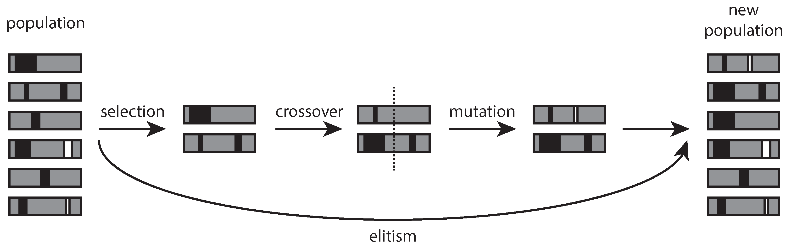

# structural-modeling

## What is this program about?
This program is about automating strucural modeling tasks using CSi software (ETABS).
CSi offers front end framework that can be accessed through many programming languages such as Python, Matlab, C++, C# and VBA.
The documentation of the interface could be found in this relative path (assuming we are in application installation folder):

`.\CSi API ETABS v17.chm`

or for an example of default ETABS 18 installation in windows 10 will result in absolute path as follows:

`C:\Program Files\Computers and Structures\ETABS 18\CSi API ETABS v17.chm`

This is the screenshot of the introduction to CSi API (application programming interface):

*Introduction to CSi API*

## Limitations
The program is just to automate the modeling process of simple 3D space frame as shown in figures below.
Parameter of the program are in the Excel document and retrieved to Python program and will be supplied to API from CSi. This is the list of the parameter used in the automation of the modeling:

    
  *Plan view (X-Y axis plane)*     
  *Side view (Y-Z axis plane)*     
  *Front view (X-Y axis plane)*

Besides the configuration, users also can model many materials (concrete and reinforcement bars) and section properties using Excel to later interact with the programming interface.

*Structural optimization is out of the scope of this program.*

## Parameter of the program

The objective of the program is to automate modeling process of 3D simple space frame and their section properties.
- Geometry properties  
The parameter for geometry is given in `GEOMETRI` sheet in the Excel.
It consists of the structural configuration in x, y, and z axis.
This is the list of the parameter:  
`Jumlah Lantai` = number of story  
`Tinggi Lantai Tipikal` = typical story height (2nd and upper story height)  
`Tinggi Lantai Bawah` = first floor story height  
`Jumlah Bentang X` = number of spans in X direction  
`Jumlah Bentang Y` = number of spans in Y direction  
`Bentang X` = length of structural elements in X direction  
`Bentang Y` = length of structural elements in Y direction  

- Material properties
Material properties is defined for several parameter such as ultimate compression stress for concrete 
(The modulus of elasticity is derived by empirical formula for conventional reinforced concrete)"

- Section properties

- Typical dead load

- Typical live load

## Future work suggestions
Structural optimization by trial and error often results in unsystematic set of solutions. 
Therefore I suggest to use machine learning optimization such as genetic algorithm (part of evolutionary algorithm) for future works.
The element of structure could be modeled as genes that being mutated and evolved in order to make the fittest individual given the constraint of structural stress and deflection.
The objective functions could be construction cost for a more abstract parameter or volume of materials for a simpler parameter.

*Evolutionary process in genetic algorithm (Guariso G., Sangiorgio, M.)*
